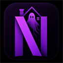
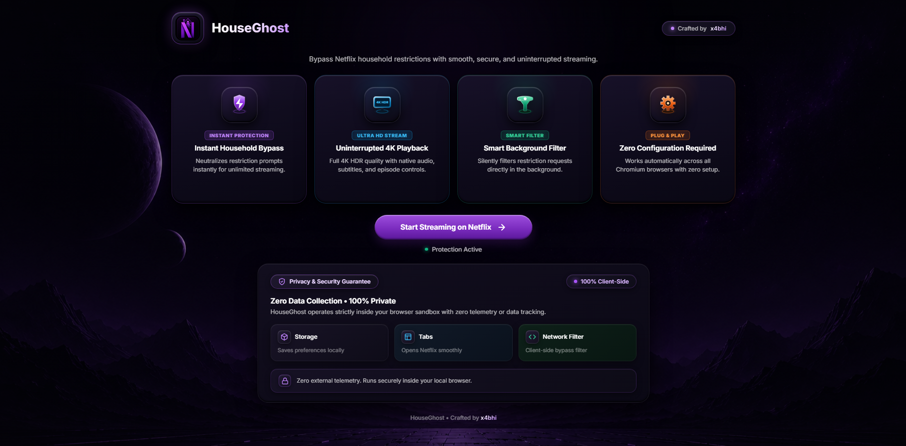

<div align="center">

  

  # HouseGhost
  **Seamless Netflix Household Restriction Bypass Extension**

  [](https://developer.chrome.com/docs/extensions/mv3/intro/)
  [](README.md)
  [](LICENSE)
  [](manifest.json)

  <p align="center">
    A lightweight, open-source browser extension that eliminates Netflix household verification dialogs and streaming interruptions silently in the background while preserving native 4K HDR playback and player controls.
  </p>

  <br>

  

</div>

<br>

---

## Key Features

* **Instant Household Bypass**
  Silently filters and neutralizes Netflix restriction queries at the network level before they can interrupt your stream.

* **Native 4K HDR Playback & Audio**
  Unlike screen-capturing or proxy workarounds, HouseGhost preserves Netflix native video streams, Dolby Vision/HDR10, multi-language subtitle selection, and episode controls with zero quality loss.

* **Smart Client-Side Concealment**
  Automated sub-millisecond CSS concealment and dynamic MutationObserver routines that purge restriction modals from the page and auto-resume playback instantly.

* **Zero Configuration Required**
  Pure plug-and-play. Works automatically out-of-the-box across all Chromium-based browsers with zero complicated configuration or proxy setups.

* **100% Private & Telemetry-Free**
  Operates completely offline inside your local browser sandbox. Zero data collection, zero analytics, zero external API tracking.

---

## Architecture & How It Works

| Layer | Component | Functionality |
| :--- | :--- | :--- |
| **Network Interceptor** | `ghost-filter.js` | Intercepts `CLCSInterstitialPlaybackAndPostPlayback` GraphQL queries via Fetch & XHR and returns empty `{ data: {} }` mock response |
| **Visual Shield** | `content-scripts/content.css` | Injects instant concealment styling to prevent prompt popups while preserving native player controls |
| **Playback Guard** | `content-scripts/content.js` | Real-time monitor that purges restriction prompts and auto-resumes video playback without interruptions |
| **Service Worker** | `background.js` | Manages extension lifecycle, updates, and onboarding launch events |

---

## Installation Guide

### Supported Browsers
* Google Chrome
* Brave Browser
* Microsoft Edge
* Opera / Opera GX
* Vivaldi / Arc

---

### Step-by-Step Setup

1. **Clone or Download the Repository**

```bash
git clone https://github.com/x4abhi/HouseGhost.git
```

*(Or download the ZIP from GitHub and extract it to a folder).*

2. **Open Extensions Page in Browser**
* **Chrome / Brave**: `chrome://extensions/`
* **Edge**: `edge://extensions/`

3. **Enable Developer Mode**
* Toggle the **Developer mode** switch in the top-right corner of the Extensions page.

4. **Load Unpacked Extension**
* Click the **Load unpacked** button in the top-left corner.
* Select the `HouseGhost` folder.

5. **Start Streaming**
* The onboarding dashboard will launch automatically.
* Click **Start Streaming on Netflix** and enjoy uninterrupted movies and shows!

---

## Repository Structure

| File / Directory | Purpose |
| :--- | :--- |
| `manifest.json` | Manifest V3 extension configuration |
| `background.js` | Background service worker lifecycle handler |
| `ghost-filter.js` | Core GraphQL network request interceptor |
| `onboarding.html` | 3D Sci-Fi onboarding dashboard |
| `popup.html` | Extension toolbar status popup |
| `assets/` | Background artwork, styles, and preview assets |
| `chunks/` | Localization and UI interaction handlers |
| `content-scripts/` | Real-time guard, modal purger, and visual shield |
| `icons/` | Multi-resolution extension icons (16px to 512px) |
| `_locales/` | Localization strings (English en-US) |
| `CONTRIBUTING.md` | Open-source contribution guidelines |
| `LICENSE` | MIT License file |
| `README.md` | Complete project documentation |

---

## Privacy & Security

| Feature | Status |
| :--- | :--- |
| **Telemetry / Tracking** | None |
| **External API Calls** | None |
| **Analytics** | None |
| **Data Collection** | None |
| **Execution Environment** | 100% Local Browser Sandbox |

---

## Contributing

Contributions are welcome! Please feel free to submit a Pull Request or open an Issue to report bugs or suggest enhancements.

Please read `CONTRIBUTING.md` for details on code style and development process.

---

## License

Distributed under the **MIT License**. Open source and free for personal and educational use.

```text
MIT License
Copyright (c) 2026 x4bhi
Permission is hereby granted, free of charge, to any person obtaining a copy...
```

See the [`LICENSE`](LICENSE) file for full license terms and conditions.

---

<div align="center">

  ### Show Your Support
  If you find HouseGhost helpful, give it a star on GitHub!

  <br>

  <sub>Crafted with care by <strong>x4bhi</strong></sub>

</div>
